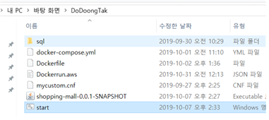
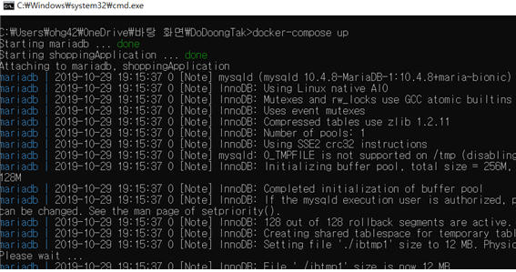
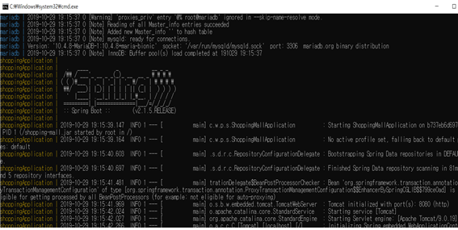
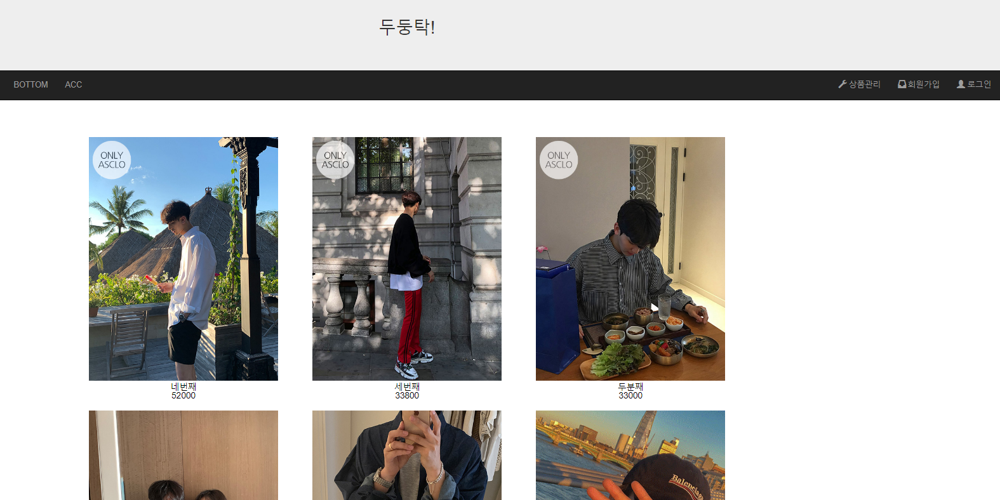
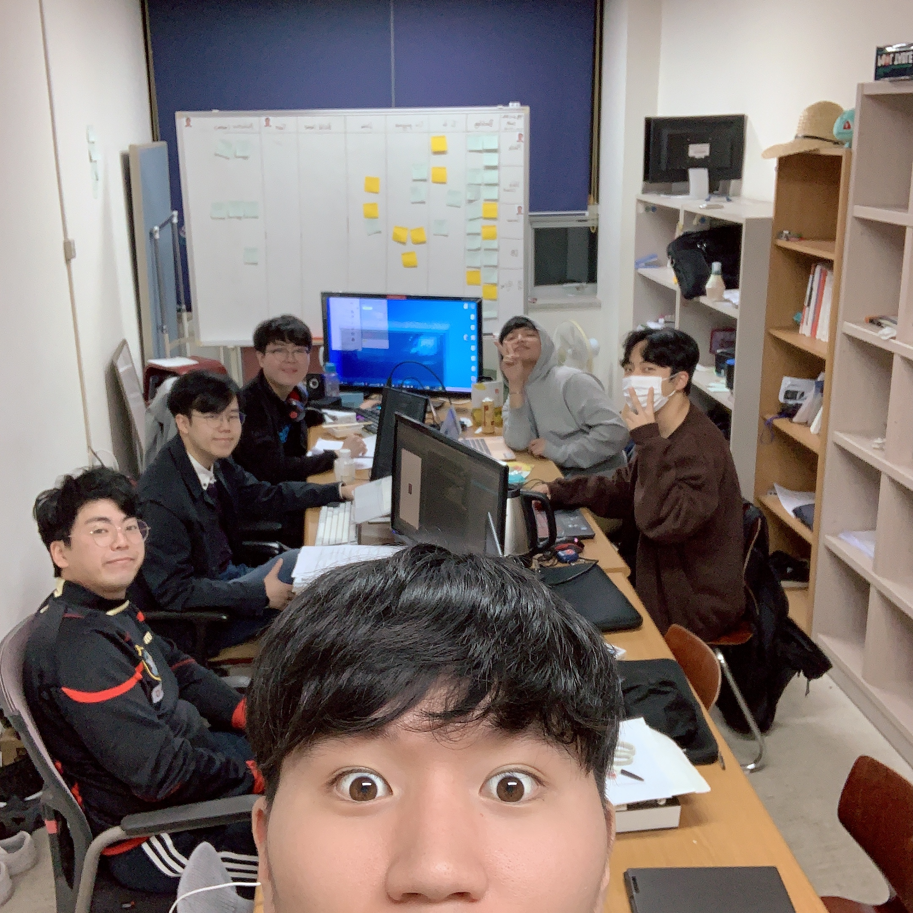
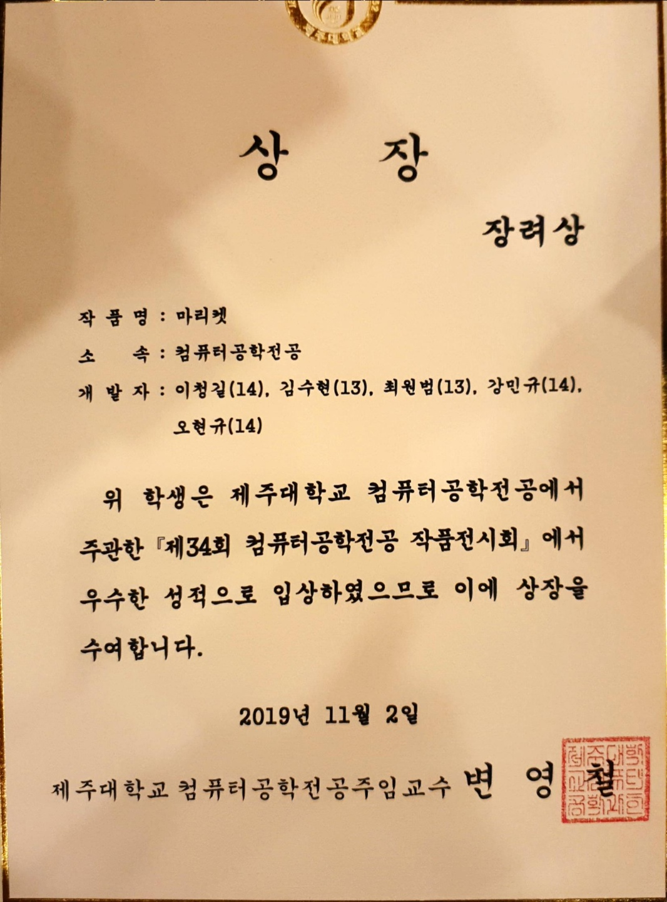

# HyeonGyu-OH!

## Project 
### 1. 제대로 가자 ( 저장소: https://github.com/aerain/jedaeroReactNative )  
- **개발 정보: React-Native &nbsp; 개발 기간: 2018-07-26 - 2019-04-07** 
&nbsp; &nbsp; 기존에 만들었던 제주대학교에 다양한 정보를 제공하는 웹앱인 '제대로 가자'의 서버 상시 오픈의 문제점과 프론트엔드와 백엔드의 알고리즘의 문제점을 고치고, 앱을 통해서 언제든지 필요한 정보를 얻게 하기 위해서 리뉴얼을 기획했습니다. 사용언어는 하나의 코드로 ios ,android 앱을 동시 개발할 수 있는 React-Native를 사용했습니다. 
&nbsp; &nbsp; 현재 교내 동아리, 기자단, 사업단에서 계속해서 인터뷰 제의가 올 정도로 많은 사람들이 관심을 가지고 있는 앱이 되었습니다!  
**Play Store: https://play.google.com/store/apps/details?id=com.jedaeroreactnative**
<pre> 기능 소개
 - 교내 순환버스 출발시간
 - 도서관 내 도서검색
 - 제주대 공식 학사일정
 - 학식 및 기숙사식당 주간 요일별 메뉴
 - 스마트출석 페이지 re-Direction
 - 캠퍼스 내 식당들과 배달 가능 식당 전화번호 re-Direction
</pre>
   
- **역할** 
<pre>
저는 앱 아이콘 제작, 스플래쉬 화면 제작 등 앱의 전체적인 프론트를 맡았습니다. 
 - '제대로 가자' 앱은 Main 화면에서 버스시간과 , 학식, 기숙사 식당 메뉴를 제공하고있습니다.
 - 버스시간 탭:  평일,주말 구분 / 정류장별 도착시간 알고리즘 제작  , 버스 시간 실시간 refresh 구현 
 - 식당 메뉴 탭:  Main에서는 메뉴를 일부만 보여주는데 탭을 터치 했을때 금일 전체메뉴를 보여주는 뷰로 이동하는 기능 구현
 - 개발자 정보: 개발자 정보, github 주소제공 , 개발에 사용한 오픈소스 라이선스를 명시하는 뷰 생성 
</pre>

### 2. 캐글(Kaggle) 타이타닉 컴피티션 밋업 
- **개발 정보: python, jupyter , pandas &nbsp; 개발 기간: 2019.02 - 2019.03**  
&nbsp; &nbsp; 캐글코리아에서 주최한 '타이타닉 생존자 예측'대회에 참여해서 직접 데이터 분석을 하고 모델링을 해서 정확도를 검증해 대회에 제출하기 까지에 과정을 발표하는 모임을 가졌습니다.
  

### 3. GIFT ( 저장소: https://github.com/g-i-f-t/GiftApplication ) 
- **개발 정보: SpringBoot, Android , mariaDB  &nbsp; 개발 기간: 2019.04.10 - 2019.06.11**  
&nbsp; &nbsp; GIFT( Game Industy Funding Trade )는 인디게임을 출시하고 싶지만 초기자본을 구하기 어려운 개발자들을 위해서 크라우드 펀딩을 통해 자금을 지원하는 서비스입니다.
<pre> 기능 소개
 - 금융결제원 API 연동 
 - 계좌조회,입출금 기능
 - 투자정보 타임라인 제공
 - 개발된 인디게임(모바일,pc)정보 제공
 - 개발자 앱과 연동 (펀딩상품 관리가능)
</pre>
 
- **역할** 
<pre>
프로젝트 초기에는 mariaDB를 사용해서 ERD모델을 설계했습니다.
DB설계 후 안드로이드 앱 파트를 담당하게 되었습니다. 
  1. GIFT서버와 통신을 해서 금융결제원 API 폼을 불러와 사용자 계좌를 인증하는 기능
  2. 회원가입 시 입력한 정보를 서버에 전송 (ROOM DB활용, 비밀번호는 SHA-256으로 변경해서 전송)
  3. 자동로그인 구현
  4. 인벤 인디뉴스 게시판 , 인디게임 카페 게시판 크롤링을 통해  인디게임 정보제공
</pre>

### 4. 환절기 저리 가!습기야( 저장소: https://github.com/rbrbrb7290/Arduino )
- **개발 정보:Android , C++ &nbsp; 개발 기간: 2018.11 - 2018.12**  
&nbsp; &nbsp; 겨울철 환절기때마다 건조함에 찾아오는 인후통이 잦은 사람들의 가습기 사용은 필수적입니다. 아팠을때 가습기 전원을 조종하는 것조차 힘들었던 기억을 살려서'전원을 원격으로 제어하거나 센서를 통해서 자동으로 가습기 전원을 제어 할 수 있다면 좋지 않을까?'라는 생각에서 시작한 프로젝트입니다! 
<pre>
  1. 스마트폰과 아두이노 사이에 블루투스 통신을 합니다.
  2. 개조한 멀티탭과 연결된 릴레이 모듈을 통해서 가습기를 on/off합니다.
  3. 가습기가 켜지면 온습도센서가 동작하여 일정 습도가 되면 가습기가 on/off되게 됩니다.  
</pre>
#### 작동 과정입니다.
 
#### 전체 구성 사진입니다.
 
- **어려웠던 점** 
<pre>
-   멀티탭을 개조하는 과정이 220V 전압을 다루는 작업이라 위험요소때문에 프로젝트를 중단할까 많이 고민했지만 한번 해보자해서 도전해봤습니다.
-   블루투스 통신 시 기존 아두이노 통신앱을 사용했습니다. 전원 버튼을 누르면 text로 'on'을 보내게 되는데 아두이노 
   에서는 'o' ,'n' 이렇게 1byte씩 받아와서 조건문이 충족되지 않아 이 원인을 알아내는데 시간을 많이 썼습니다.
-   이러한 문제를 해결하기위해 받아오는 char형 data를 String으로 형 변환을 시켜주고 두 글자를 합쳐서 새로운 변수에 담아 보내서 조건문을 충 
   족시키게 만들었습니다.
</pre>

### 5. BietNam SmartFarm Project( 저장소: https://github.com/smartfarmvietnam/Arduino )
-  **개발 정보:Arduino , C++ , Node.js &nbsp; 개발 기간: 2019.08.04 - 2019.08.21**  
&nbsp; &nbsp; NIA(한국정보진흥원)주관, 제주대학교 SW중심대학 소개를 통해 베트남 '박리에우' 지역 대학교에 봉사활동 명목으로 파견을 나갔습니다.
아두이노 기기를 통해 현지 시간과 습도를 측정, 농장에 자동화를 위한 하드웨어를 설치하고 프로그래밍을 통해 LED조명, 워터펌프를 자동화시켰습니다. 
그리고 데이터 수집을 위해 node.js서버를 만들어 온습도 데이터를 DB에 저장시키도록 했습니다. 
- **역할** 
  프로젝트의 PM을 맡았습니다.
<pre>
 1. 데이터 수집을 위해 필요한 아두이노 기기 조립
 2. 아두이노와 서버간의 통신 구조, 실제 농장의 설치할 기기 구상도 설계 
 3. 아두이노 D1R1보드를 사용해서 서버와 HTTP통신하는 작업을 맡았고, Server작업 보조
 4. 농장 관리자가 스마트폰으로도 데이터값을 수시로 확인할수있게 반응형 웹 프론트 페이지 제작
</pre>
#### 스마트팜 Before.

 </img>
 </img>     
 </img>   

 
#### 스마트팜 After.

 </img>

                                                                     
- **어려웠던 점** 
<pre>
- 우선 베트남의 무덥고 습한 날씨, 통풍이 안되는 하우스안에서 작업을 했기에 하드웨어를 설치하는데 어려움이 있었습니다.  
- 아두이노 기기를 사용할때 전기,전류에 대해서도 어느정도 알고있어야 하기에 새로운 센서,보드를 사용할때마다 공부해나가야하는 어려움. 
- 실제 농장에 아두이노를 설치할때 기본적으로 제공되는 케이블의 길이가 너무 짧았고, 습기에 대해 안전한 UTP선으로 대체하기로 했습니다. 
- 베트남 현지 사람들과 작업을 하는데에 있어서 의사소통이 잘 안되는 문제가 있었습니다.
</pre>

### 6. 두둥탁(Do Doong Tack!)( 저장소: https://github.com/rbrbrb7290/WebPublishing-Service )
- **개발 정보:JAVA, Spring Boot , JavaScript , Thymeleaf &nbsp; 개발 기간: 2019.04 - 개발중**   

- **내용** 
  간단한 클릭만으로도 웹사이트를 만들수있어서 컴퓨터를 몰라도 손쉽게 개인 쇼핑몰을 운영할수있게 만드는 서비스입니다.

 </img>
 </img>     
 </img>
 </img>   

- **어려웠던 점** 
<pre>
- Spring MVC패턴의 사이클을 이해하는 과정이 어려웠었고, HTTP통신에 대한 개념도 확실히 잡혀 있지 않던 상태라 많은 공부가 필요했습니다. 
- @Controller와 @RestController의 명확한 차이를 알기까지의 과정.
- DB에 데이터를 아무리 보내도 글자가 깨지는 이유를 몰랐을때.. (DB설치를 하고 초기 Server와 DB의 캐릭터셋을 UTF-8로 설정해주지 않아서였습니다..) 
- Thymeleaf같은 템플릿엔진의 힘을 빌어 손쉽게json data를 view에 출력하는 것이 아닌, 비동기 HTTP통신을 해서 data를 받아오는 과정.
- image를 서버에 받아 클라이언트에 보내는 과정이 힘들었습니다..
</pre>
- **느낀점** 
기능구현을 할때마다 어렵게만 느껴져서 기피했던 백엔드 개발에 대한 지식들을 마주하는것이 힘이들었지만, 
빌드가 성공하고 저의 노력이 눈앞에 모니터에 출력되었을때 느껴지는 희열이 너무나도 컸습니다. 
이 프로젝트를 진행하고나서 컴퓨터 코어에 대한 기본지식이 탄탄하다면 다른 언어, 다른 영역의 개발을 하게되어도 금방 배울수있다는 것을 알게 되었습니다. 

### 7. 마리켓(마이 리틀 티켓)( 저장소: https://github.com/mrfourfour) 
- **개발 정보: Spring WebFlux, AWS(DynamoDB, Cognito, Elastic BeansTalk), Android, vue.js, graphQL, Docker, Travis**
- **개발 기간: 2019.04 - 개발중** &nbsp;  
- **내용** 
  마리켓은 판매자가 무형 상품(콘서트 , 쿠폰)을 등록하면, 사용자가 상품을 구매하여 모바일 QR코드 티켓을 발급 받게 됩니다.
이 티켓은 행사 당일 QR리더기를 통해 사용처리 할 수 있습니다.
- **기여** 
AWS DynamoDB를 사용해 DB제작을 하였고, Spring WebFlux를 사용해서 판매자 서버(repo: seller-server)를 제작했습니다.

 </img>
 </img>     

</pre>

- **느낀점** 
기존에 사용해오던 기술이 아닌 새로운 영역에 기술들을 접하면서 많은 어려움이 많았지만, 주마다 팀원들이 각자 맡은 파트에서 학습한 부분을 세미나 식으로 발표했고 의견을 나누면서 몰랐던 부분을 알게 되면서 서서히 개념이 잡히게 되었습니다.
이번 기회를 통해서 프로그램의 퍼포먼스의 효율을 높혀주는 여러 기술들이 많다는 것을 알았고, 새로운것을 알아간다는 것에 재미도 다시 한번 느낄 수 있었습니다. 또 뒤쳐지지 않는 개발자가 되기 위해 기술 컨퍼런스를 자주 찾아보는 습관을 들여야겠다 생각했습니다.

